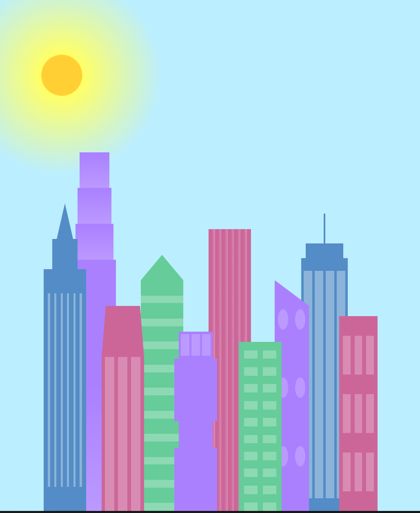
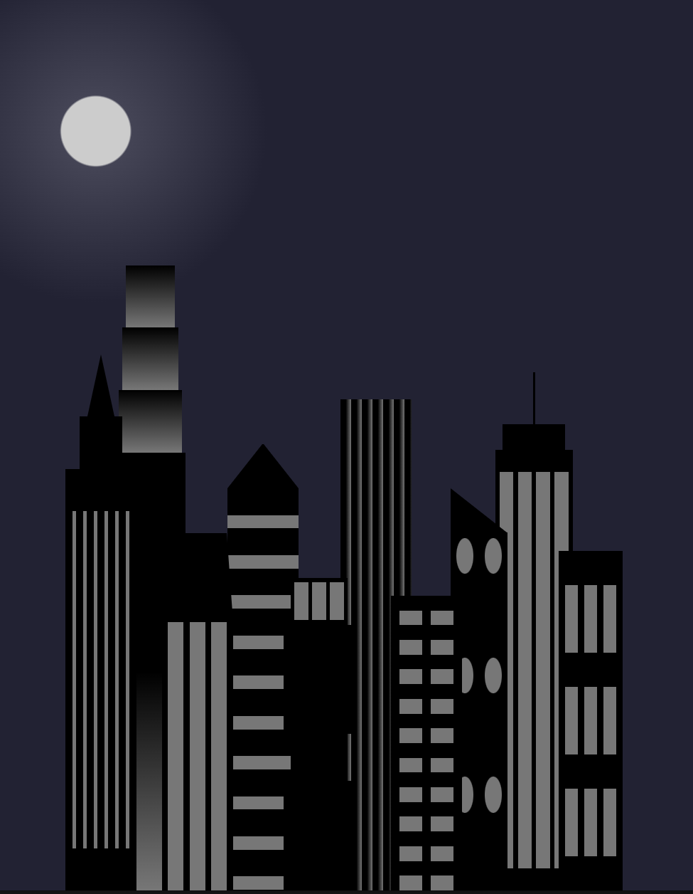

# 🌆 CSS Variables Build - City Skyline

This project demonstrates the use of **CSS variables** and **media queries** to build a responsive, stylized city skyline. The skyline changes from **daylight** to **nighttime** based on the screen width, showcasing CSS techniques in an engaging visual format.

## ✨ Features

- Customizable buildings and windows using **CSS variables**.
- Day/Night mode toggle triggered via **media queries** (`max-width: 1000px`).
- Responsive layout with Flexbox.
- Decorative building designs using `linear-gradient`, `repeating-linear-gradient`, and shapes.

---

## 🌇 Preview

### 💡 Daylight (width > 1000px)



### 🌙 Night (width ≤ 1000px)



---

## 🧑‍💻 Technologies Used

- **HTML5**
- **CSS3**
  - CSS Variables (`:root`)
  - Media Queries
  - Flexbox
  - Gradient backgrounds

---

## 📁 File Structure

```
css-variables-build-city-skyline/
├── index.html
├── styles.css
├── README.md
└── images/
    ├── daylight-preview.png
    └── night-preview.png
```
## 🛠️ How it works
Defined under `:root` for reuse and easy theme switching:
```
:root {
  --building-color1: #aa80ff;
  --window-color1: #bb99ff;
  /* other variables */
}
```

## Media Query
Triggered when the screen width is 1000px or less:
```
@media (max-width: 1000px) {
  :root {
    --building-color1: #000;
    --window-color1: #777;
    /* other overrides */
  }

  .sky {
    background: radial-gradient(...);
  }
}

```

## 📱 Responsive Design
- Uses `display: flex` and `justify-content: space-evenly` to distribute skyline buildings.

- Automatically switches between day and night modes based on viewport width.

## 📌 Usage
1. Clone this repo
```
git clone https://github.com/karianjahi/css-variables-build-city-skyline.git
```
2. Open `index.html` in your browser.

3. Resize the browser to observe the **day-to-night** transition below `1000px` width.


## 🧠 What You'll Learn
- How to use CSS variables for theme consistency.

- How to apply media queries for responsive design.

- How to build complex visuals using pure CSS.

- How to organize scalable, reusable styles.

## 🖼️ Acknowledgements
- This project is inspired by a [freeCodeCamp](https://www.freecodecamp.org/) curriculum challenge that teaches CSS variables and media queries in a creative and visual way.

- Special thanks to the [freeCodeCamp](https://www.freecodecamp.org/) team and community for providing excellent open-source learning resources.

## 📄 License
This project is open-source and available under the MIT License.
